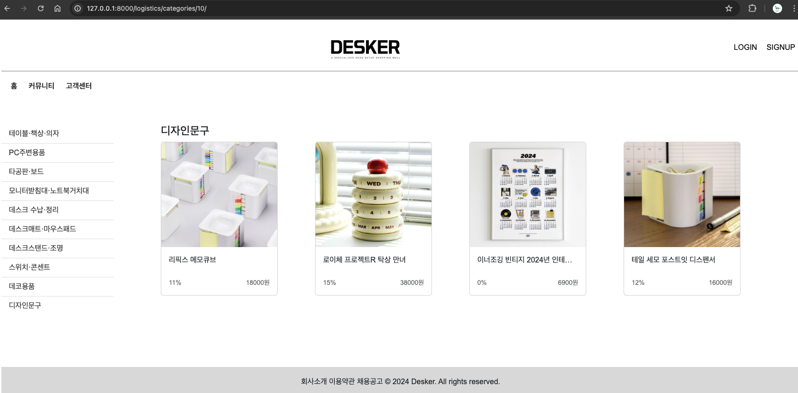
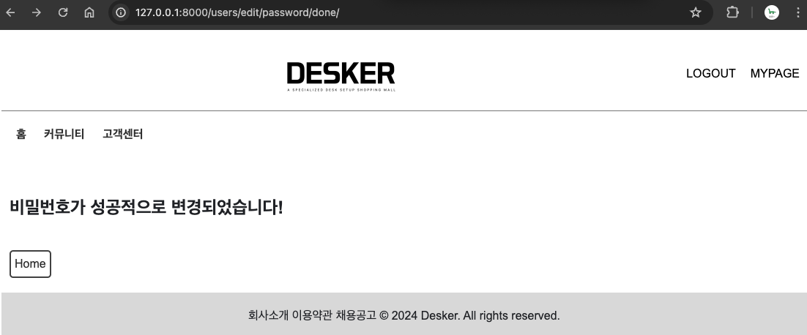
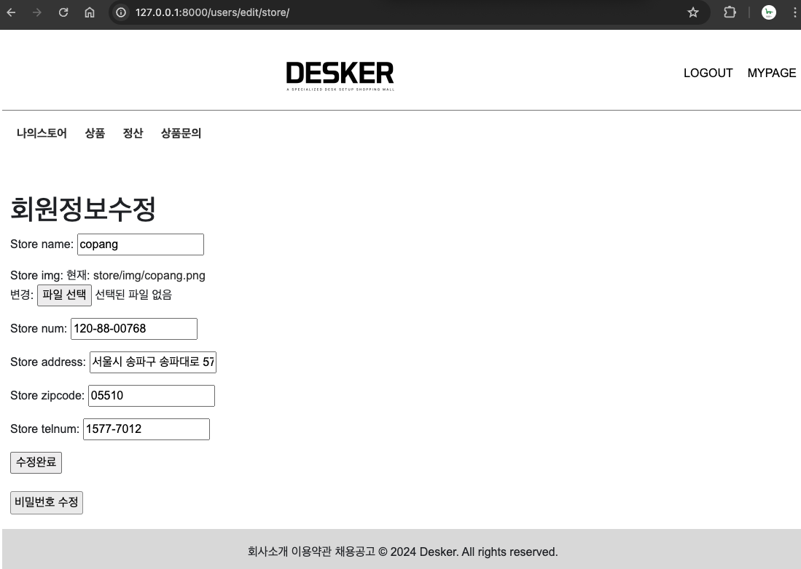
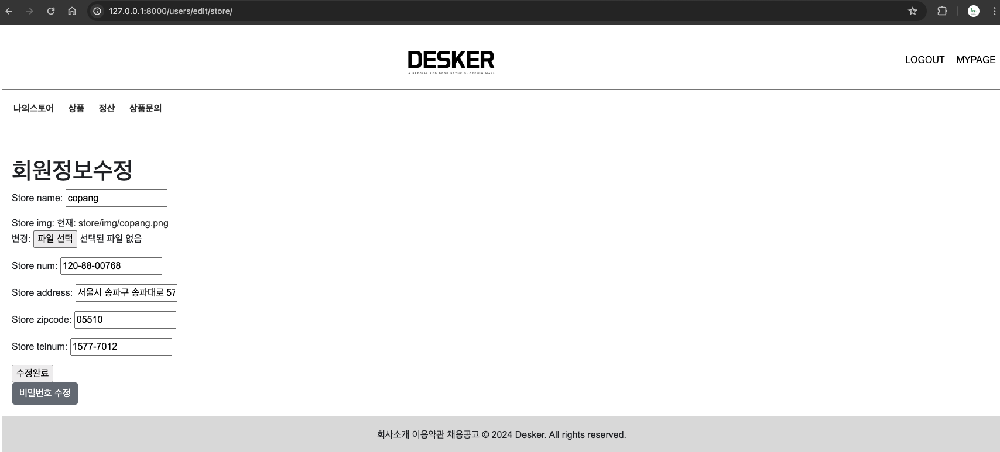
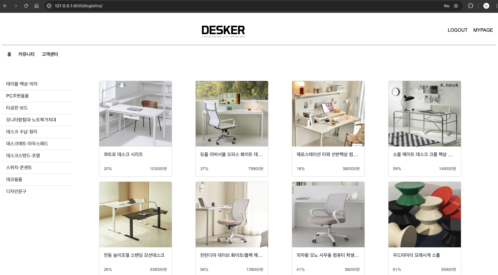
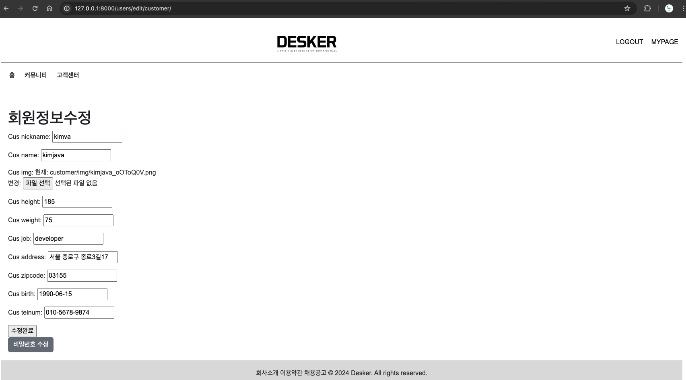
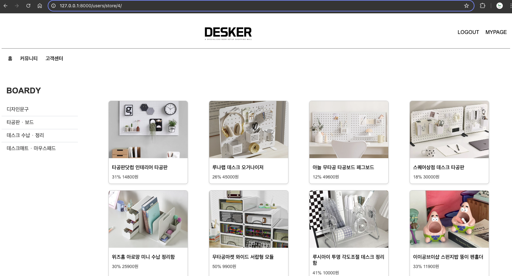
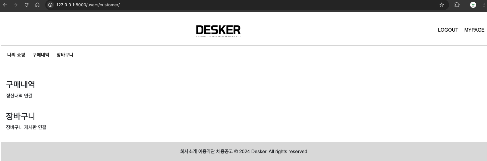

### 2024.05.02
### 메인 페이지

### 카테고리별 상품 페이지

### 로그인 페이지

### store 로그인 > store 페이지(상품)

### store 로그인 > store 페이지(마이페이지)

### customer 로그인

### customer 로그인 > store 페이지(마이페이지)

*******

### 2024.05.03
### Login 페이지에 들어가야 회원가입 가능하도록 변경
### 판매자 페이지 구성 - 정산내역(연결필요)/새로 등록한 상품/상품문의(연결필요)

### 상품 상세페이지 views/templates 수정
### customer 기준 판매자 페이지 생성
 ### Logo 이미지 클릭 시, 메인 페이지로 이동
### 비밀번호변경화면에서 화면 이동 버튼 추가

### 회원정보수정 페이지의 버튼 수정
 
 ### 카테고리 위에 전체상품 보이도록 링크 추가
 

*******

### 2024.05.07
### 상품detail 에서 store 클릭 시, 해당 상품을 판매하는 판매자 페이지로 이동 (판매하고 있는 상품들의 카테고리만 보임)

### base.html > main_base, noncategory_base, store_base, customer_base, customer_store_base
### customer 로그인 시, mypage 생성
